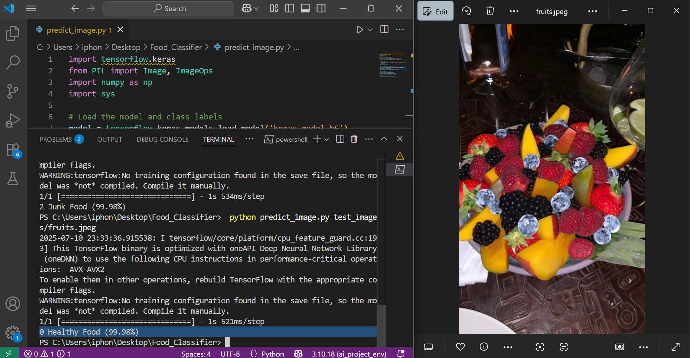
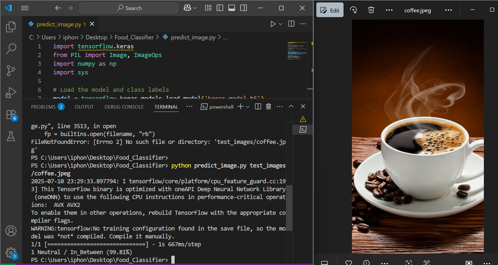
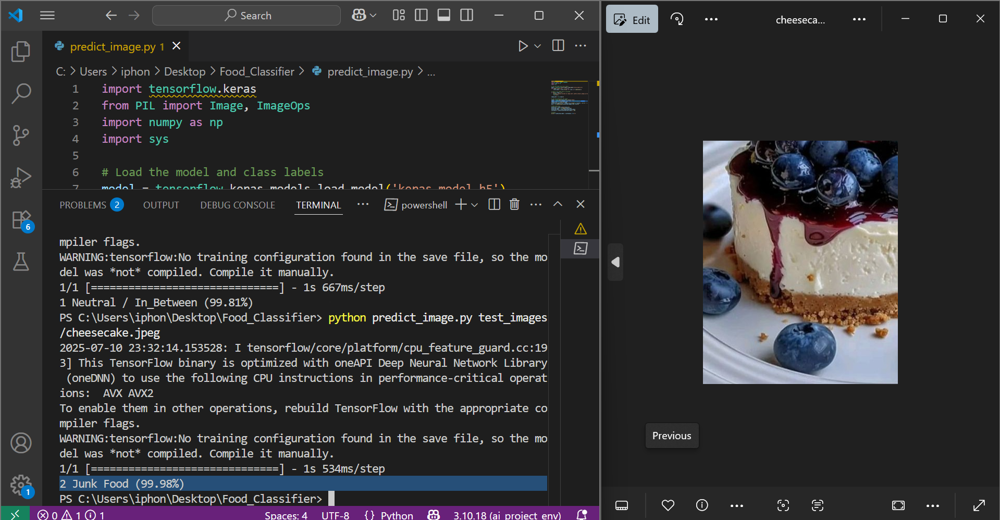

# 🍽️ Smart Food Classifier  
> Using Teachable Machine + Python & TensorFlow

Have you ever opened your fridge and wondered:  
_"Is this snack healthy or secretly evil?"_ 😅

This project is a fun and simple **image classifier** that helps you predict whether a food item is:

- 🥗 **Healthy** (e.g. vegetables, fruits, grilled chicken...)
- 🍔 **Junk** (e.g. burgers, chips, soda…)
- ⚖️ **Neutral / In-Between** (e.g. white rice, sweetened yogurt, white bread...)

---

## 🎯 What We Did

1. **Collected images** for 3 categories of food & drink.  
2. **Trained a model** using [Teachable Machine by Google](https://teachablemachine.withgoogle.com/).  
3. **Exported** the model in **Keras / TensorFlow** format.  
4. Wrote a Python script to:
   - Load the trained model  
   - Preprocess a given image  
   - Predict the food class with confidence  
5. 🎉 Tested the model on real images!

---
## 📦 Requirements
To run this project, make sure you have the following installed:

🐍 Python 3.x – The core programming language

🧠 TensorFlow – To load and run the trained Keras model (keras_model.h5)

🖼 Pillow – For image processing (resizing, converting to RGB, etc.)

🔢 NumPy – To convert image data into arrays the model understands

 📥 Install with pip

You can install all the required packages using:
```bash
pip install tensorflow pillow numpy
```
---

## 🧠 Why This Matters

Food awareness isn't just for fitness gurus.  
This tool can be a **fun educational project** for kids, students, or anyone curious about what they’re eating!

You can even expand it to detect:
- 🍭 Sugar content  
- 🌱 Vegan vs Non-Vegan  
- 🍳 Cooked vs Raw  

---

## 🛠 How to Use

1. Clone the repo  
2. Add your test images into the `test_images/` folder  
3. In terminal, run:

```bash
python predict_image.py test_images/your_image.jpg
```
---

## 📸 Sample Output





